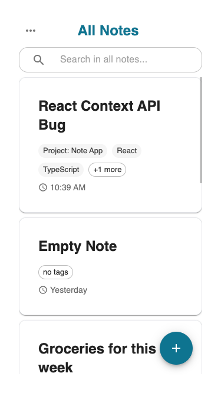
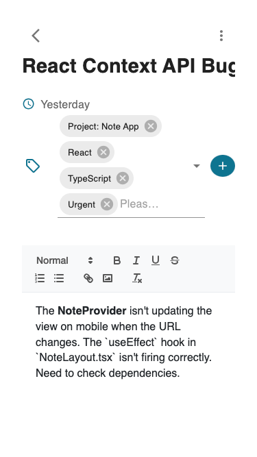
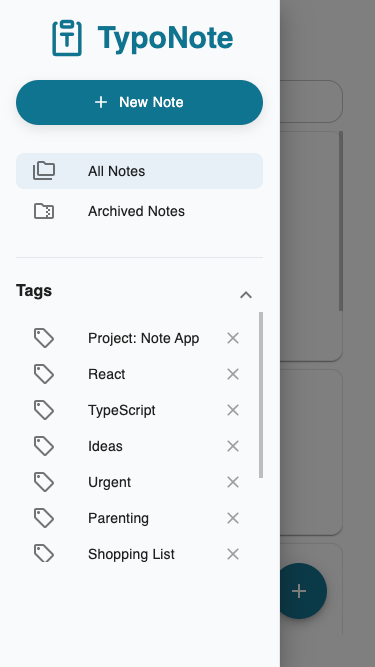

# ✏️ TypoNote - A Responsive Note-Taking App

This is a fully-featured, responsive note-taking application built entirely as a **client-side only application**. It runs completely in your browser with no backend or database required.

This project leverages the browser's `localStorage` to provide full data persistence—all notes and tags are securely saved on your own device.

## 🚀 Live Demo

**[Click Here to view the Live Demo!](https://joans-typo-note.vercel.app/)**

### Desktop View


### Mobile View

To provide a native experience, the mobile layout separates the note list and the detail view into a natural interactive flow.

<table>

  <tr>
    <td align="center">
      <strong>Note List View</strong>
    </td>
    <td align="center">
      <strong>Note Detail View</strong>
    </td>
     <td align="center">
      <strong>Note Side View</strong>
    </td>
  </tr>
  <tr>
    <td>
      
    </td>
    <td>
      
    </td>
       <td>
      
    </td>
  </tr>
</table>

---

## 🌟 Key Features

- **Rich Text Editing:**
  - Powered by `React Quill`, supporting headers, bold, italics, links, and bulleted/numbered lists.
- **Full Note Management:**
  - Create, edit, archive, and permanently delete notes.
- **Powerful Tagging System:**
  - Dynamically add or remove tags from any note.
  - Filter all notes by selecting a tag from the sidebar.
- **Real-time Search:**
  - Instantly search across all note titles, content, and tags.
- **Fully Responsive Design:**
  - A single codebase that provides a seamless, native-like experience on both desktop and mobile.
- **Data Persistence:**
  - All notes and tags are stored in the browser's `localStorage`.
  - Your data **remains saved** even after refreshing, closing the browser, or restarting your computer.

---

## 🛠️ Tech Stack

- **Front-End:** React
- **Language:** TypeScript
- **UI Framework:** Material-UI (MUI)
- **Routing:** React Router DOM
- **State Management:** React Context API
- **Text Editor:** React Quill
- **Client-Side Storage:** `localStorage`
- **Build Tool:** Vite
- **Deployment:** Vercel

---

## 🏃‍♂️ How to Run Locally

1.  Clone this repository
    ```bash
    git clone [https://github.com/joan-hq/note-taking-app.git](https://github.com/joan-hq/note-taking-app.git)
    ```
2.  Navigate to the project directory
    ```bash
    cd note-taking-app
    ```
3.  Install dependencies
    ```bash
    npm install
    ```
4.  Start the development server
    ```bash
    npm run dev
    ```
5.  Open `http://localhost:5173` in your browser
